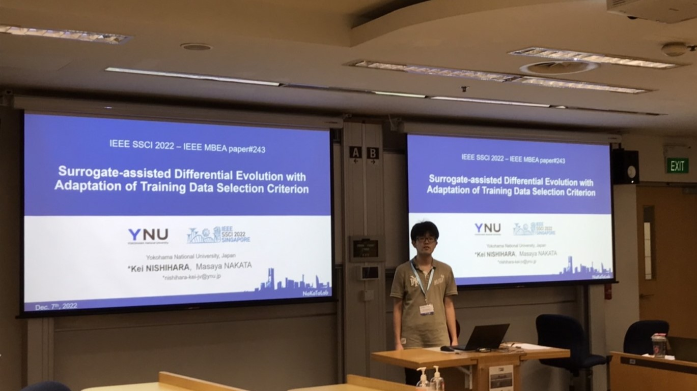
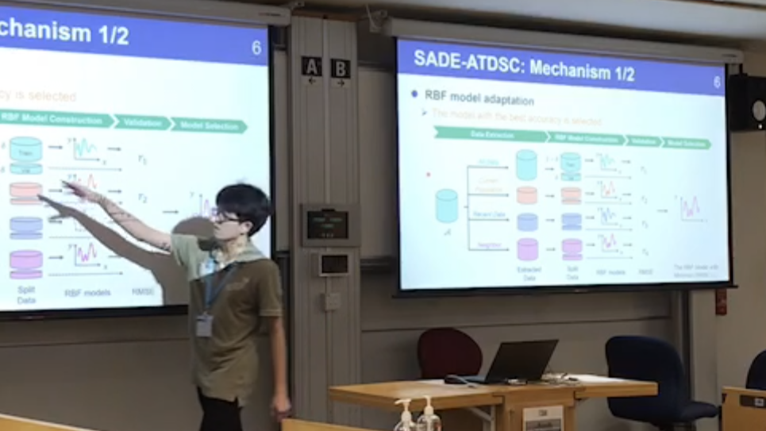

### Message

I gave a presentation titled \"[Surrogate-assisted Differential Evolution with Adaptation of Training Data Selection Criterion]()\" at IEEE Symposium Series on Computational Intelligence 2022 (IEEE SSCI 2022, 4-7, Dec.).

Not only my own presentation, but also tutorials, other presentations, Q&A, discussions, chats, and international exchanges were valuable experiences. It was especially stimulating to talk with researchers whom I had only seen in papers, and to interact with people of my generation from overseas. I kept in touch with my contemporaries after returning to Japan.

Due to the COVID-19 disaster, this was the first international conference I have attended in person, but it was a very fulfilling experience. I hope that the number of people suffering from the COVID-19 disaster will decrease and that peaceful days will be restored.

