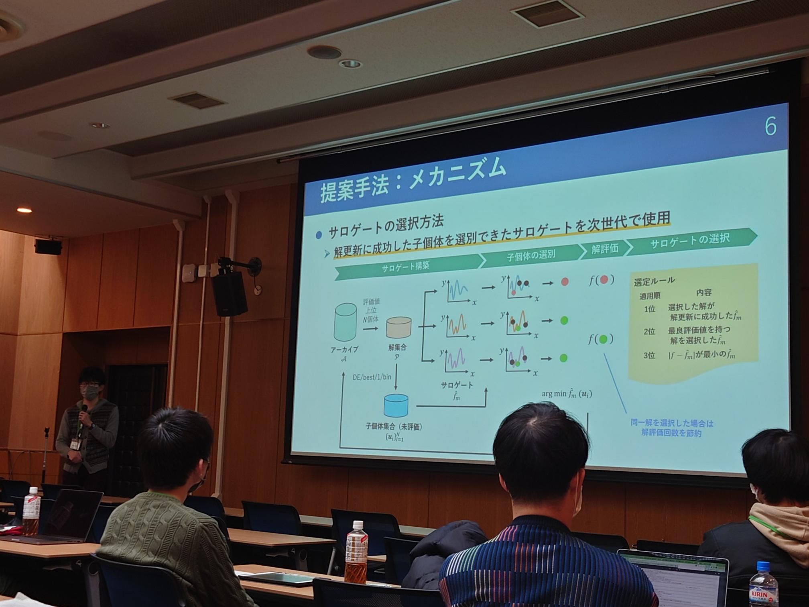
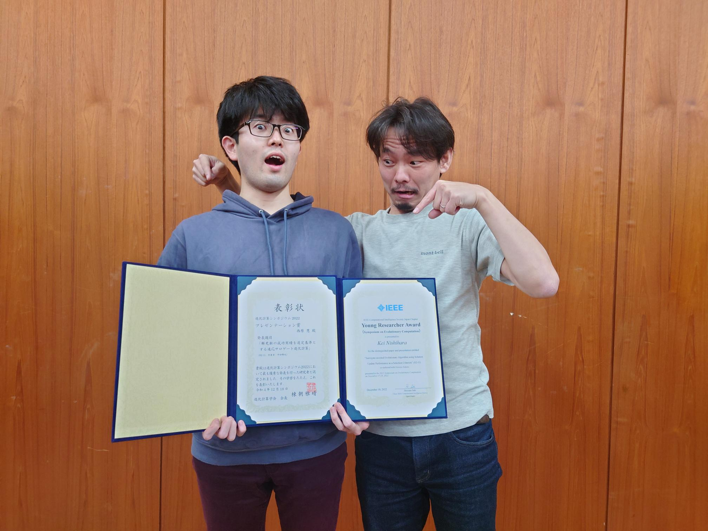

### Message

I gave a presentation \"[Surrogate-assisted Evolutionary Algorithm using Solution Update Performance as a Selection Criterion]()\" at JPNSEC Symposium on Evolutionary Computation 2022 (Hokkaido University, Sapporo, 16-18, Dec.) and got [IEEE CIS Japan Chapter Young Researcher Award](http://www.ieee-jp.org/section/tokyo/chapter/CIS-11/index.php?TopPage-J/YRA-J) and [Presentation Award](http://www.jpnsec.org/bestposters.html) at the same time.

I was also a student member of organizers for the [Open Space Discussion](https://sites.google.com/view/osd2022-jpsec) held as a pre event. Interesting discussions were held in a casual atmosphere where even students could easily participate, ranging from in-depth research topics to sharing of hints for research activities.

It was a very meaningful time for me to interact and discuss with professors and students from outside the university. The JPNSEC Symposium on Evolutionary Computation is the largest domestic event in the field, so it was a particularly valuable opportunity.

I am looking forward to attending next year!

