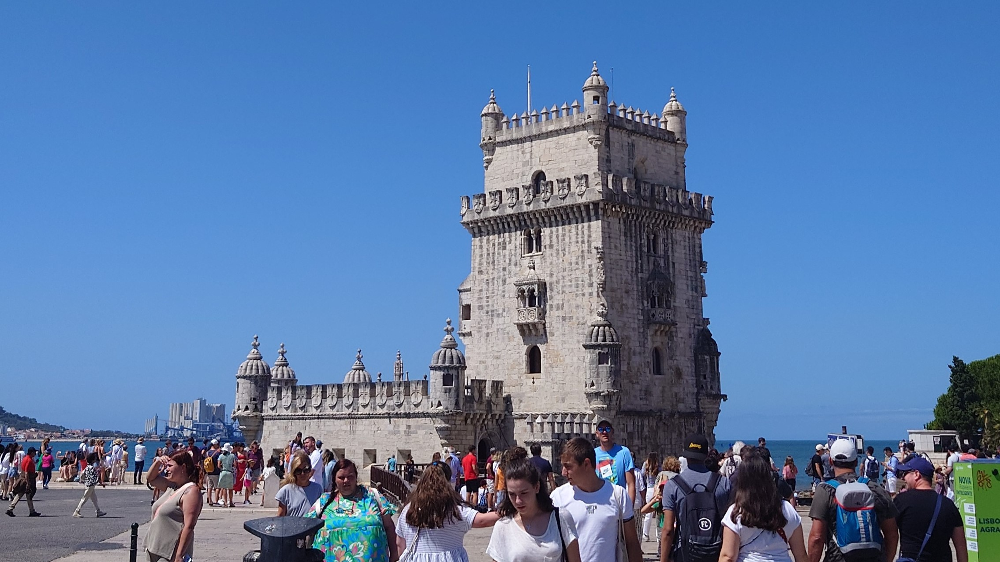

### Message

I gave a presentation entitled \"[Utilizing the Expected Gradient in Surrogate-assisted Evolutionary Algorithms]()\" at The Genetic and Evolutionary Computation Conference 2024 (GECCO 2023, Altis Grand Hotel, Lisbon, Portugal, 15-19, Jul). I would like to thank all those who discussed our research.

In addition to this conference, I also attended the [SIGEVO Summer School (S3)](https://gecco-2023.sigevo.org/Summer-School). About 30 students from all over the world attended lectures by leading researchers on their research and research tips for two days, and also had discussions on these topics. During the conference period, we worked in groups to design, implement, evaluate, and discuss constructive search method. We gave presentations about this on the fourth day of the conference. Although it was hard work at times, we absorbed a great deal of knowledge. The aggressive attitude of the other students stimulated me, and it was like a study abroad experience. The experience of deep discussion and cooperation was valuable.

