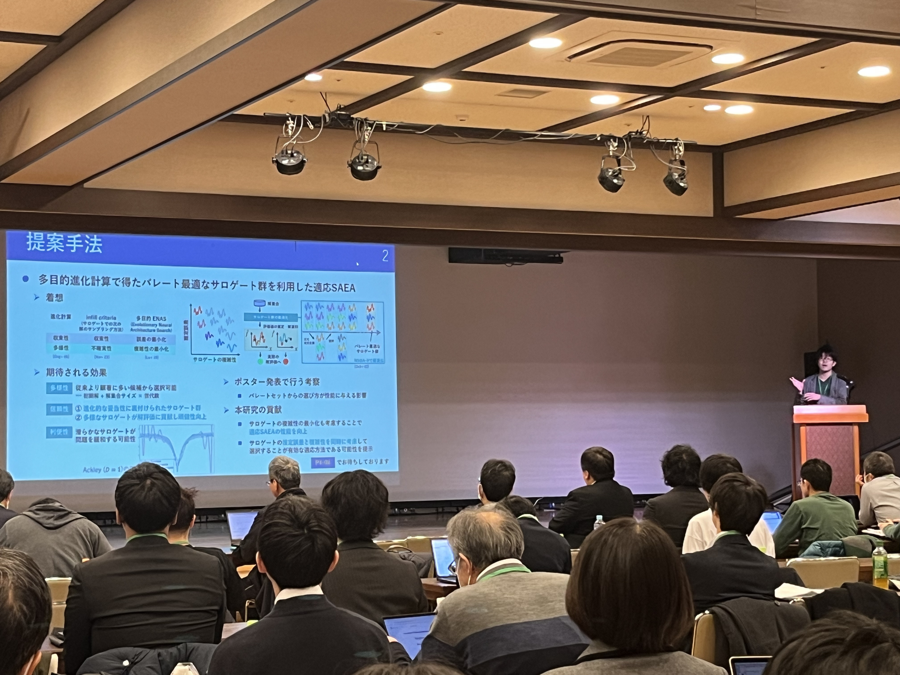
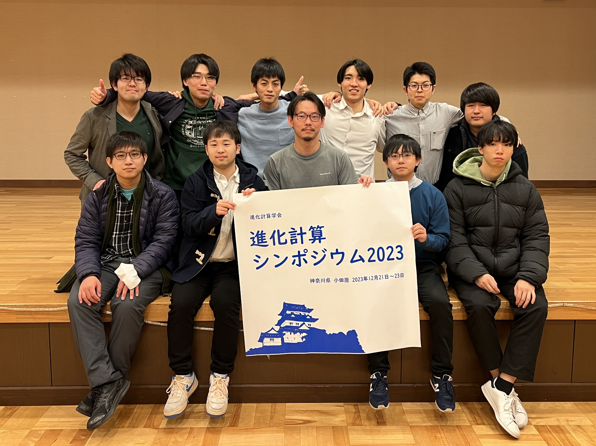

### Message

I gave a presentation \"[Surrogate-assisted Evolutionary Algorithm using Pareto-optimal Surrogates Set]()\" at JPNSEC Symposium on Evolutionary Computation 2023 (Ohoribata Convention Hall, Odawara, 21-23, Dec.).

I was also a student member of organizers for the [Open Space Discussion](https://sites.google.com/view/osd2023-jpnsec) as in the past year. This year, we had many student participants. In addition to the prepared topics, we improvisationally decided new topics from keywords on the day of the discussion.

I'm very happy to have a wider circle of professors and students from other universities.

I'd also like to thank our supervisor and lab students for their hard work in organizing the symposium (the group photo is identical to the one on the lab's website).

