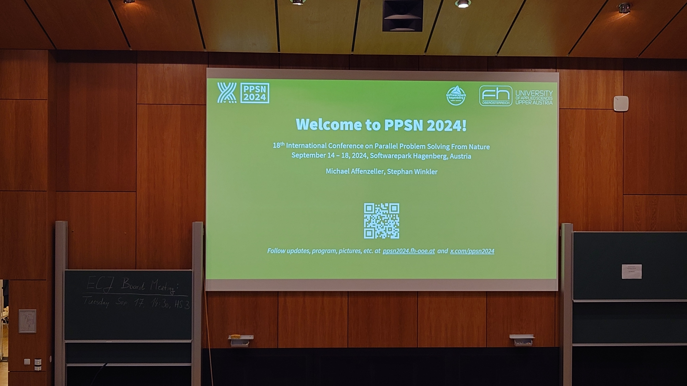
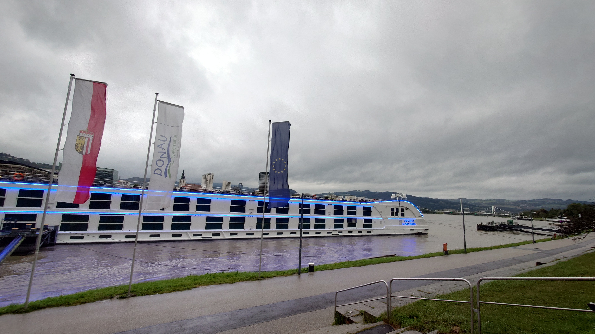
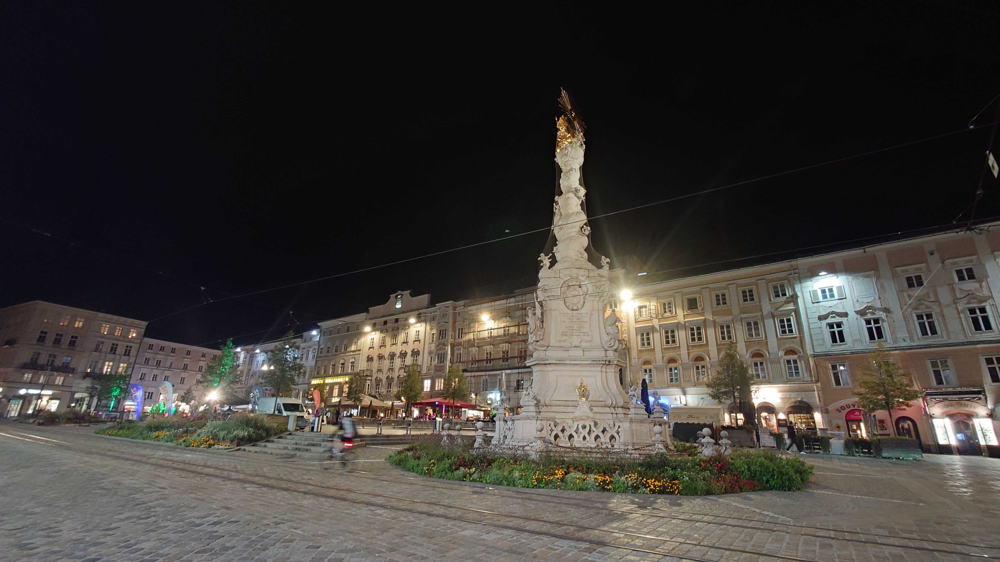
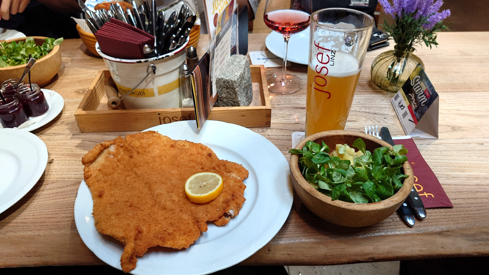

### Message

I gave a presentation entitled \"[A Surrogate-assisted Partial Optimization for Expensive Constrained Optimization Problems]()\" at International Conference on Parallel Problem Solving from Nature 2024 (PPSN 2024, University of Applied Sciences Upper Austria, Hagenberg im Mühlkreis, Austria, 14-18, Sep). All accepted papers were presented as poster presentations in PPSN. I would like to thank all those who discussed our research.

A small number of researchers, who were selected at the second-lowest acceptance rate of 34%, met with all of them every day for five days for intensive discussions and chats, and the experience of learning about each other's research and personalities was very special. There were researchers whom I met again after a long time, and there were also professors from Japan and overseas who are always grateful to me. I feel that my network of researchers is steadily expanding every time I participate in international conferences.

