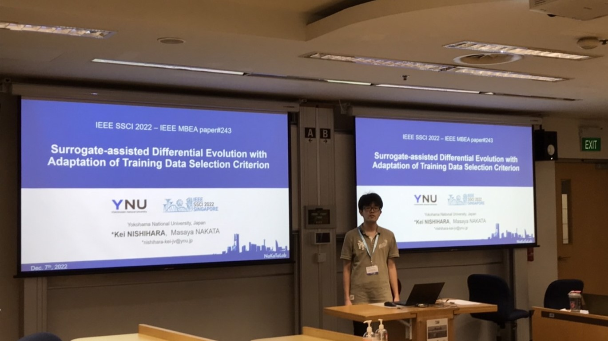
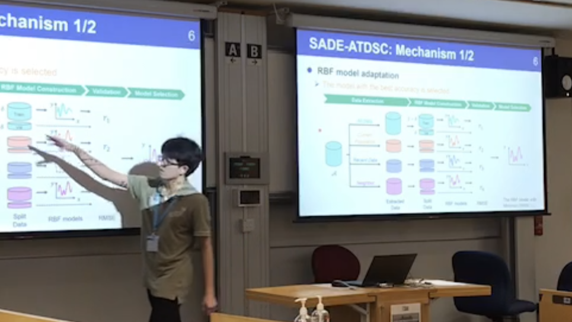

### Message

「[Surrogate-assisted Differential Evolution with Adaptation of Training Data Selection Criterion]()」というタイトルで，IEEE Symposium Series on Computational Intelligence 2022（IEEE SSCI 2021，シンガポールマネジメント大学，シンガポール，12/4-7）にて発表を行いました．

発表だけでなく，チュートリアルや発表の聴講，質問，議論，雑談，国際交流など，貴重な経験となりました．特に，論文でしかお見かけしたことがなかった研究者の方々との会話や，海外の同世代の方々との交流は刺激的でした．同世代の彼らとは，帰国後も連絡を取り合いました．

コロナ禍の影響で，対面では初参加の国際会議でしたが，非常に充実したものとなりました．コロナ禍で苦しまれる方が少しでも減り，穏やかな日々が取り戻されることを願います．

