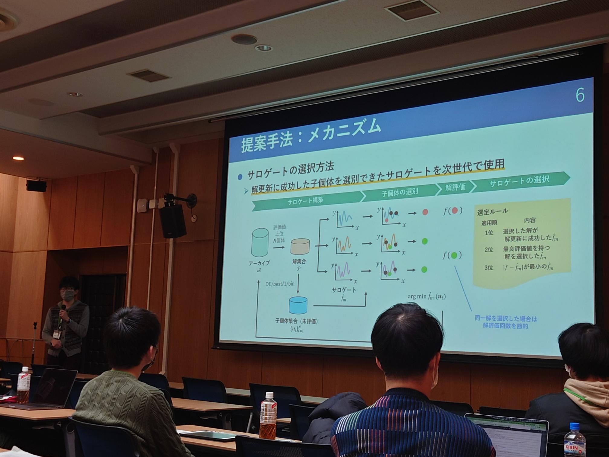
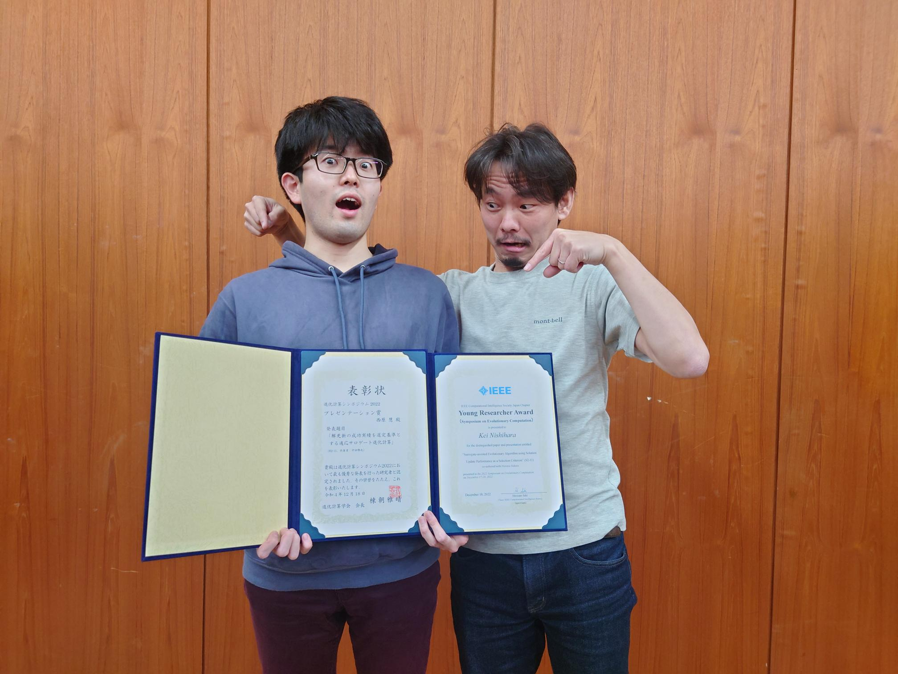

### Message

「[解更新の成功実績を選定基準とする適応サロゲート進化計算]()」というタイトルで，進化計算シンポジウム2022（北海道大学 学術交流会館，札幌，12/16-18）にて発表を行い，[IEEE CIS Japan Chapter Young Researcher Award](http://www.ieee-jp.org/section/tokyo/chapter/CIS-11/index.php?TopPage-J/YRA-J) と[プレゼンテーション賞](http://www.jpnsec.org/bestposters.html)を同時受賞しました．

また，前日イベントの[オープンスペースディスカッション](https://sites.google.com/view/osd2022-jpsec)では，学生幹事として運営に携わりました．深い研究トピックから研究活動のヒントの出し合いまで，学生でも参加しやすい気軽な雰囲気の中で，興味深いディスカッションが行われました．

先生方や学外の学生と交流や議論を行えて，非常に有意義な時間でした．特に，進化計算シンポジウムは分野で最大の国内イベントであるため，貴重な機会となりました．

来年度も楽しみです！

