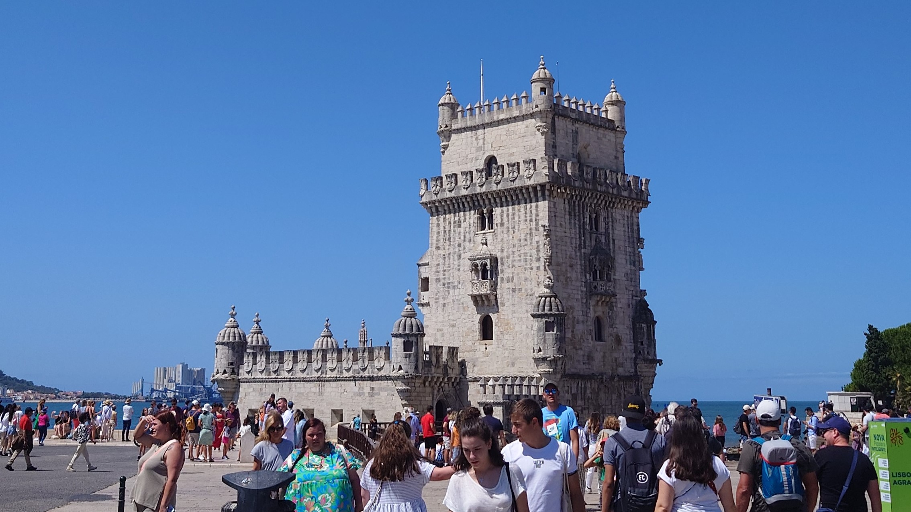

### Message

「[Utilizing the Expected Gradient in Surrogate-assisted Evolutionary Algorithms]()」というタイトルで，ACM The Genetic and Evolutionary Computation Conference 2023（GECCO 2023，アルティスグランドホテル，リスボン，ポルトガル，7/15-19）にてポスター発表を行いました．ご議論くださった方々に感謝いたします．

本会議に加え，[SIGEVO Summer School (S3)](https://gecco-2023.sigevo.org/Summer-School)にも参加しました．ここでは，世界中から集まった30人ほどの学生が丸2日に渡り，最先端の研究者からの研究内容や研究ノウハウの講義を受講し，これらに関する議論も行いました．また，本会議中の空き時間にはグループワークとして，constructive search の設計・実装・評価・考察を行い，最終日前夜に発表を行いました．ハードな時もありましたが，多くを吸収することができました．他の学生の積極的な姿勢にも刺激され，留学体験のようでした．深く議論し協力しあった体験は，貴重なものとなりました．

