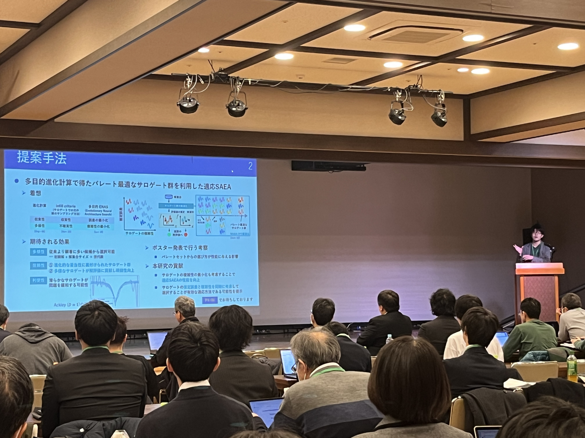
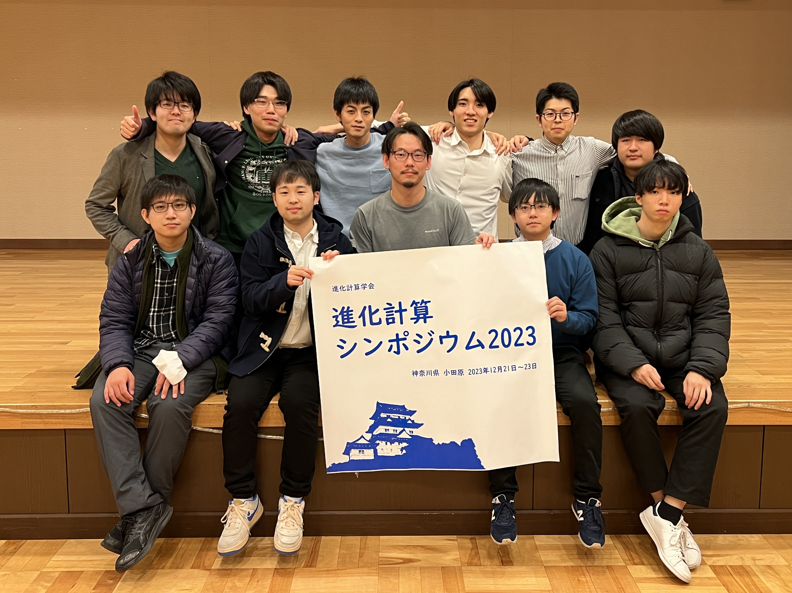

### Message

「[パレート最適なサロゲート群を利用する適応サロゲート進化計算]()」というタイトルで，進化計算シンポジウム2023（小田原お堀端コンベンションホール，小田原，12/21-23）にて発表を行いました．

また，前日イベントの[オープンスペースディスカッション](https://sites.google.com/view/osd2023-jpnsec)では，学生幹事として運営に2年連続で携わりました．今年は学生の参加者が多い中で，キーワードからトピックを当日に決定する試みもあり，ディスカッションの新しい形が見られました．

先生方や学外の学生との交流の輪が年々広がり，研究議論から情報交換まで行えて，大変嬉しく思います．

また，研究室の先生やB4～M2のみなさんのシンポジウム運営に感謝します（集合写真は，研究室ホームページの写真と同一です）．

