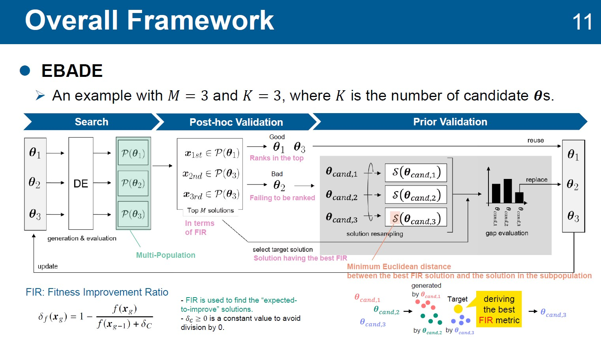

### Message

「[Emulation-based adaptive differential evolution: fast and auto-tunable approach for moderately expensive optimization problems]()」というタイトルの，適応進化計算に関する論文が [Complex & Intelligent Systems](https://link.springer.com/journal/40747) に採択されました．

本論文は，中程度に高コストな最適化問題に有効な手法として，差分進化（Differential Evolution: DE）のパラメータ設定を最適化中に自動調整する適応DEを提案しました．提案手法は，高コストな最適化問題の代表的手法であるサロゲート進化計算のような，サンプル効率の良い手法の模倣を，機械学習なしにパラメータ設定の適応で実現しました．具体的には，解集合を複数のサブ解集合に分割し，それぞれのサブ解集合に一つのパラメータ設定を付与します．これにより，一つのパラメータ設定はサブ解集合内の複数の解によって検証されます．また，既に発見した暫定最良解を模倣するようなパラメータ設定を，その使用に先立って選定する事前検証機構で，パラメータ設定の効率的な適応を実現しました．

実験では，これまで有効な手法がほとんど提案されてこなかった，中程度に高コストな最適化問題を想定したシナリオで，提案手法は既存の適応DEやサロゲート進化計算より高い性能を導出しました．また，提案手法はサロゲート進化計算よりも大幅に高速な最適化を可能にしました．そして，提案手法は，高コストな最適化問題での実現が困難であった，パラメータ設定の自動調整を可能にした，使い勝手の良い手法となりました．

