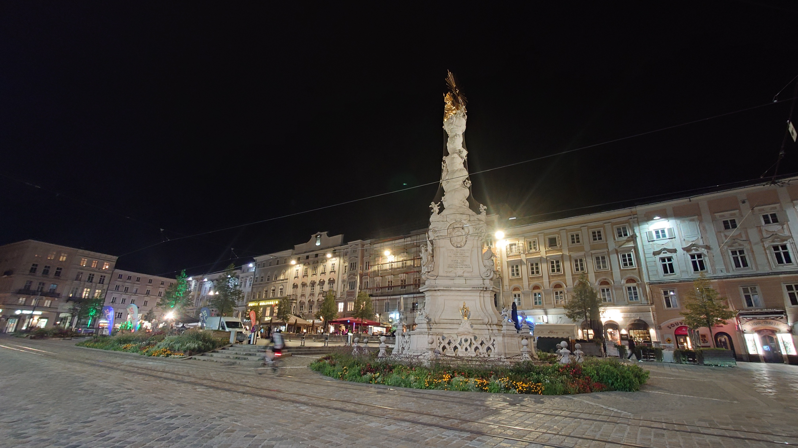

### Message

「[A Surrogate-assisted Partial Optimization for Expensive Constrained Optimization Problems]()」というタイトルで，International Conference on Parallel Problem Solving from Nature（PPSN 2024，University of Applied Sciences Upper Austria，Hagenberg im Mühlkreis，オーストリア，9/14-18）にてポスター発表を行いました．すべての発表はポスター形式でした．ご議論くださった方々に感謝いたします．

34%という過去2番目に低い採択率で絞られた少人数の研究者が，5日間毎日全員と顔を合わせ濃密に議論や雑談をして，お互いの研究も人となりも覚えていく体験は格別でした．久しぶりに再会した研究者やいつもお世話になっている国内外の先生方もおり，国際会議に参加する度に研究者ネットワークが着実に広がっていることを感じます．

